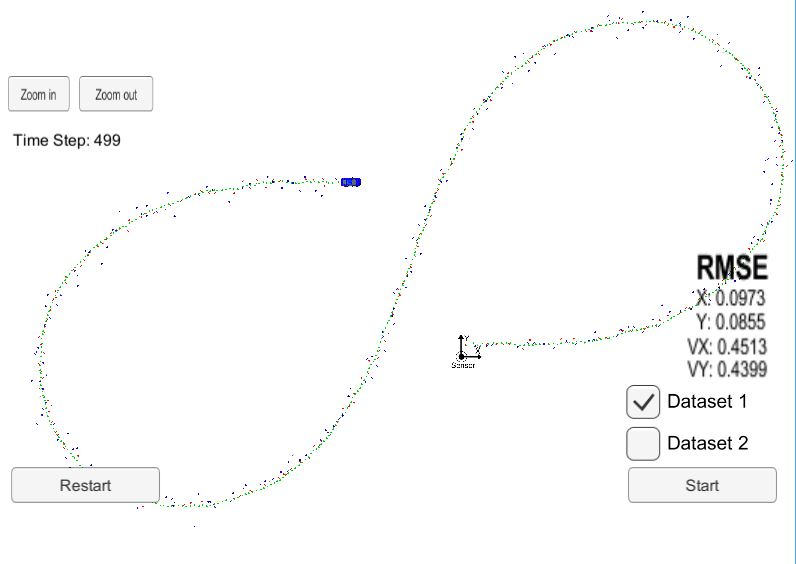

# Extended Kalman Filter
This Project is the sixth task (Project 1 of Term 2) of the Udacity Self-Driving Car Nanodegree program. The main goal of the project is to apply Extended Kalman Filter to fuse data from LIDAR and Radar sensors of a self driving car using C++.

The project was created with the Udacity [Starter Code](https://github.com/udacity/CarND-Extended-Kalman-Filter-Project).


## Result

Accuracy - RMSE: [0.0973, 0.0.855,  0.4513,  0.4339]

The results were visualized with [Sensor Fusion utilities](https://github.com/udacity/CarND-Mercedes-SF-Utilities).

## How to run the code
Clone this repo and perform 
```
cd build
./ExtendedKF

```
